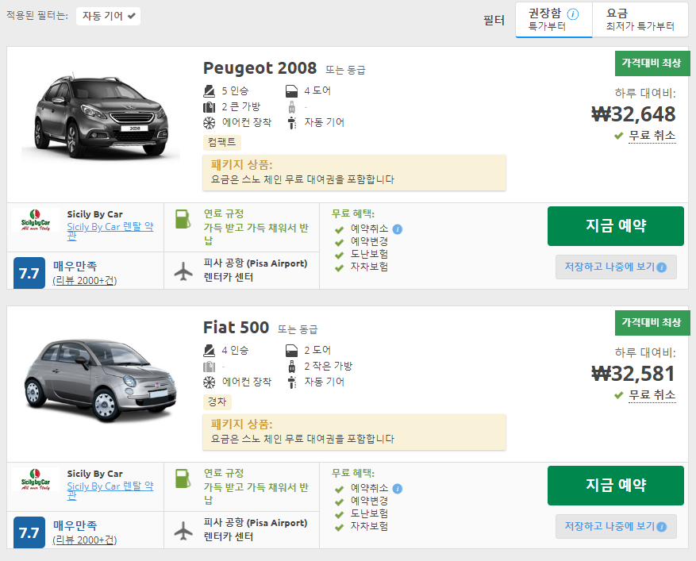
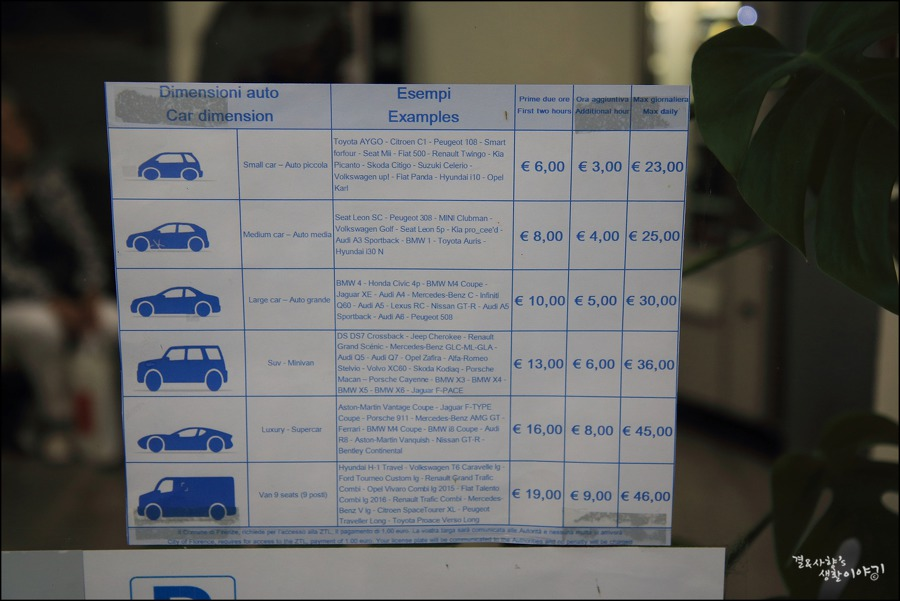
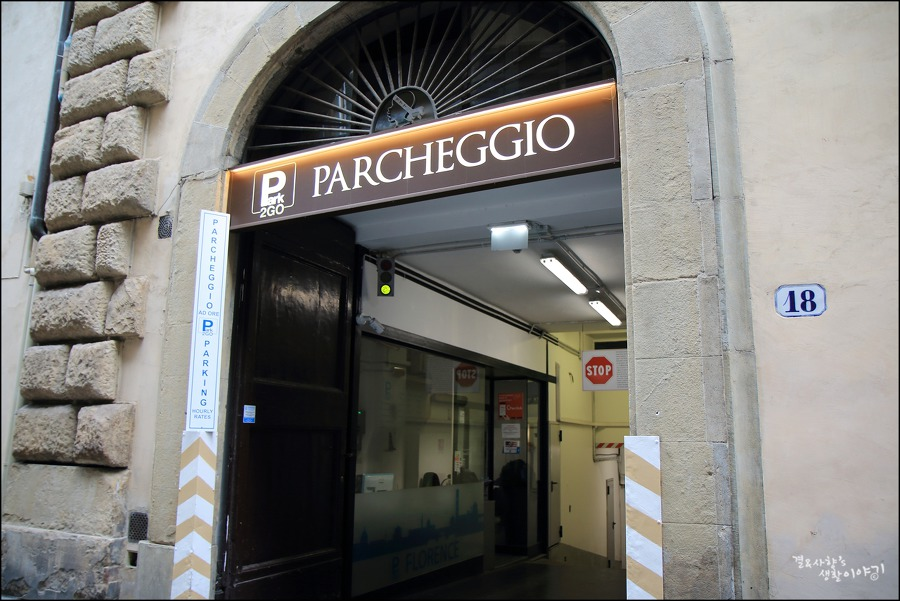

<h1>Table of Contents<span class="tocSkip"></span></h1>
<div class="toc"><ul class="toc-item"><li><span><a href="#렌트카-정보" data-toc-modified-id="렌트카-정보-1"><span class="toc-item-num">1&nbsp;&nbsp;</span>렌트카 정보</a></span></li><li><span><a href="#피사--&gt;-피렌체" data-toc-modified-id="피사-->-피렌체-2"><span class="toc-item-num">2&nbsp;&nbsp;</span>피사 -&gt; 피렌체</a></span></li><li><span><a href="#명소" data-toc-modified-id="명소-3"><span class="toc-item-num">3&nbsp;&nbsp;</span>명소</a></span><ul class="toc-item"><li><span><a href="#우피치-미술관" data-toc-modified-id="우피치-미술관-3.1"><span class="toc-item-num">3.1&nbsp;&nbsp;</span>우피치 미술관</a></span></li><li><span><a href="#시뇨리아-광장,-베키오-궁전" data-toc-modified-id="시뇨리아-광장,-베키오-궁전-3.2"><span class="toc-item-num">3.2&nbsp;&nbsp;</span>시뇨리아 광장, 베키오 궁전</a></span></li><li><span><a href="#두오모-성당" data-toc-modified-id="두오모-성당-3.3"><span class="toc-item-num">3.3&nbsp;&nbsp;</span>두오모 성당</a></span></li><li><span><a href="#미켈란젤로-광장" data-toc-modified-id="미켈란젤로-광장-3.4"><span class="toc-item-num">3.4&nbsp;&nbsp;</span>미켈란젤로 광장</a></span></li></ul></li><li><span><a href="#식당" data-toc-modified-id="식당-4"><span class="toc-item-num">4&nbsp;&nbsp;</span>식당</a></span></li><li><span><a href="#카페" data-toc-modified-id="카페-5"><span class="toc-item-num">5&nbsp;&nbsp;</span>카페</a></span><ul class="toc-item"><li><span><a href="#Caffe-Gilli" data-toc-modified-id="Caffe-Gilli-5.1"><span class="toc-item-num">5.1&nbsp;&nbsp;</span>Caffe Gilli</a></span></li><li><span><a href="#Caffe-Scrudieri" data-toc-modified-id="Caffe-Scrudieri-5.2"><span class="toc-item-num">5.2&nbsp;&nbsp;</span>Caffe Scrudieri</a></span></li><li><span><a href="#Caffe-La-Terrazza" data-toc-modified-id="Caffe-La-Terrazza-5.3"><span class="toc-item-num">5.3&nbsp;&nbsp;</span>Caffe La Terrazza</a></span></li><li><span><a href="#Gelateria-Santa-Trinita" data-toc-modified-id="Gelateria-Santa-Trinita-5.4"><span class="toc-item-num">5.4&nbsp;&nbsp;</span>Gelateria Santa Trinita</a></span></li></ul></li></ul></div>


```python
from IPython.display import display
from IPython.core.display import HTML 
```

# 렌트카 정보

* [렌트카 검색 결과](https://www.rentalcars.com/SearchResults.do?enabler=&country=%EC%9D%B4%ED%83%88%EB%A6%AC%EC%95%84&doYear=2018&city=%ED%94%BC%EC%82%AC+%28Pisa%29&ordering=recommended&driverage=on&doFiltering=false&filterName=CarCategorisationSupplierFilter&exSuppliers=&dropCity=%ED%94%BC%EC%82%AC+%28Pisa%29&driversAge=30&filterTo=1000&fromLocChoose=true&dropLocationName=%ED%94%BC%EC%82%AC+%EA%B3%B5%ED%95%AD+%28Pisa+Airport%29&dropCountryCode=&doMinute=30&countryCode=it&advSearch=&filterAdditionalInfo=&puYear=2018&locationName=%ED%94%BC%EC%82%AC+%EA%B3%B5%ED%95%AD+%28Pisa+Airport%29&puMinute=0&doDay=15&searchType=&filterFrom=0&puMonth=12&dropLocation=307937&doHour=21&dropCountry=%EC%9D%B4%ED%83%88%EB%A6%AC%EC%95%84&puDay=15&puHour=14&location=307937&doMonth=12&filterTransmission=Automatic) : 기본은 약 **3만3천원**, 풀커버 보호상품 적용시 약 **5만5천원** (픽업/반납 : 2시 - 9시30분)



* [학회장에서 렌트카 매장까지](https://www.google.co.kr/maps/dir/Educational+Center+of+Piagge,+Via+Giacomo+Matteotti,+11,+56124+Pisa+PI,+%EC%9D%B4%ED%83%88%EB%A6%AC%EC%95%84/Sicily+By+Car/@43.7047742,10.3995705,15.75z/data=!4m14!4m13!1m5!1m1!1s0x12d59193efe7c6b9:0x37a0754cbaa4f0a9!2m2!1d10.4123461!2d43.7102769!1m5!1m1!1s0x0:0xb58dd49ffb09ce82!2m2!1d10.399155!2d43.6990239!3e0)  : 차로 약 6분 


```python
toRentcar_html = '<iframe src="https://www.google.com/maps/embed?pb=!1m24!1m8!1m3!1d11537.111469473097!2d10.3995705!3d43.7047742!3m2!1i1024!2i768!4f13.1!4m13!3e0!4m5!1s0x12d59193efe7c6b9%3A0x37a0754cbaa4f0a9!2zRWR1Y2F0aW9uYWwgQ2VudGVyIG9mIFBpYWdnZSwgVmlhIEdpYWNvbW8gTWF0dGVvdHRpLCAxMSwgNTYxMjQgUGlzYSBQSSwg7J207YOI66as7JWE!3m2!1d43.7102769!2d10.412346099999999!4m5!1s0x0%3A0xb58dd49ffb09ce82!2sSicily+By+Car!3m2!1d43.6990239!2d10.399155!5e0!3m2!1sko!2skr!4v1543993167988" width="600" height="450" frameborder="0" style="border:0" allowfullscreen></iframe>'
display(HTML(toRentcar_html))
```


<iframe src="https://www.google.com/maps/embed?pb=!1m24!1m8!1m3!1d11537.111469473097!2d10.3995705!3d43.7047742!3m2!1i1024!2i768!4f13.1!4m13!3e0!4m5!1s0x12d59193efe7c6b9%3A0x37a0754cbaa4f0a9!2zRWR1Y2F0aW9uYWwgQ2VudGVyIG9mIFBpYWdnZSwgVmlhIEdpYWNvbW8gTWF0dGVvdHRpLCAxMSwgNTYxMjQgUGlzYSBQSSwg7J207YOI66as7JWE!3m2!1d43.7102769!2d10.412346099999999!4m5!1s0x0%3A0xb58dd49ffb09ce82!2sSicily+By+Car!3m2!1d43.6990239!2d10.399155!5e0!3m2!1sko!2skr!4v1543993167988" width="600" height="450" frameborder="0" style="border:0" allowfullscreen></iframe>


# 피사 -> 피렌체

* [ZTL](https://www.google.com/maps/d/viewer?mid=1TyOvX7BB3-spnryCgxB7XjZUGqs&hl=en_US&ll=43.76893826485115%2C11.252735850000022&z=14) (차량제한구역?) 때문에, 도시 내부에 주차를 하려면 승인된 private garage에서 해야함


* Park2go : 두오모 성당 근처 주차장. (참고: 주차장 이용 후기 http://kayasa.tistory.com/209)
  - 입차, 출차 입구에서 직원이 해준다는 듯
  - 주차요금
  
  
  
  - 정면
  


* [렌트카 매장에서 Park2go 가는길](https://www.google.co.kr/maps/dir/Sicily+By+Car,+Piazzale+Corradino+D'Ascanio,+Pisa+PI,+%EC%9D%B4%ED%83%88%EB%A6%AC%EC%95%84/Park2Go+Parcheggio+Firenze,+Via+Ricasoli,+18,+50122+Firenze+FI,+%EC%9D%B4%ED%83%88%EB%A6%AC%EC%95%84/@43.7734769,10.5232757,10z/data=!3m1!4b1!4m14!4m13!1m5!1m1!1s0x12d59180c9f0b2d1:0xb58dd49ffb09ce82!2m2!1d10.399155!2d43.6990239!1m5!1m1!1s0x132a540376a4ae2d:0x18ac9471dad6e4dc!2m2!1d11.257075!2d43.774768!3e0) : 80km 약 1시간 15분


```python
pisatofirenze_html = '<iframe src="https://www.google.com/maps/embed?pb=!1m28!1m12!1m3!1d260766.90144365194!2d10.595867305485282!3d43.77010021504332!2m3!1f0!2f0!3f0!3m2!1i1024!2i768!4f13.1!4m13!3e0!4m5!1s0x12d59180c9f0b2d1%3A0xb58dd49ffb09ce82!2zU2ljaWx5IEJ5IENhciwgUGlhenphbGUgQ29ycmFkaW5vIEQnQXNjYW5pbywgUGlzYSBQSSwg7J207YOI66as7JWE!3m2!1d43.6990239!2d10.399155!4m5!1s0x132a540376a4ae2d%3A0x18ac9471dad6e4dc!2zUGFyazJHbyBQYXJjaGVnZ2lvIEZpcmVuemUsIFZpYSBSaWNhc29saSwgMTgsIDUwMTIyIEZpcmVuemUgRkksIOydtO2DiOumrOyVhA!3m2!1d43.774767999999995!2d11.257074999999999!5e0!3m2!1sko!2skr!4v1543993103280" width="600" height="450" frameborder="0" style="border:0" allowfullscreen></iframe>'
display(HTML(pisatofirenze_html))
```


<iframe src="https://www.google.com/maps/embed?pb=!1m28!1m12!1m3!1d260766.90144365194!2d10.595867305485282!3d43.77010021504332!2m3!1f0!2f0!3f0!3m2!1i1024!2i768!4f13.1!4m13!3e0!4m5!1s0x12d59180c9f0b2d1%3A0xb58dd49ffb09ce82!2zU2ljaWx5IEJ5IENhciwgUGlhenphbGUgQ29ycmFkaW5vIEQnQXNjYW5pbywgUGlzYSBQSSwg7J207YOI66as7JWE!3m2!1d43.6990239!2d10.399155!4m5!1s0x132a540376a4ae2d%3A0x18ac9471dad6e4dc!2zUGFyazJHbyBQYXJjaGVnZ2lvIEZpcmVuemUsIFZpYSBSaWNhc29saSwgMTgsIDUwMTIyIEZpcmVuemUgRkksIOydtO2DiOumrOyVhA!3m2!1d43.774767999999995!2d11.257074999999999!5e0!3m2!1sko!2skr!4v1543993103280" width="600" height="450" frameborder="0" style="border:0" allowfullscreen></iframe>


# 명소

## 우피치 미술관

* 미리 예약안하면 대기열 약 2시간 이상. 온라인에서 16유로 ([예약사이트](http://www.b-ticket.com/b-ticket/uffizi/default_eng.aspx))

* [참고 블로그](https://m.blog.naver.com/PostView.nhn?blogId=irenehadi123&logNo=221220104712&proxyReferer=https%3A%2F%2Fwww.google.co.kr%2F)

* 우피치 광장 모습


* 우피치 미술관 입구


```python
uffizi_html = '<iframe src="https://www.google.com/maps/embed?pb=!1m18!1m12!1m3!1d2881.244387112332!2d11.253122115837012!3d43.76778557911773!2m3!1f0!2f0!3f0!3m2!1i1024!2i768!4f13.1!3m3!1m2!1s0x132a54008dc59081%3A0xcddeb7c89bf0c4cd!2z7Jqw7ZS87LmYIOuvuOyIoOq0gA!5e0!3m2!1sko!2skr!4v1543988020018" width="600" height="450" frameborder="0" style="border:0" allowfullscreen></iframe>'
display(HTML(uffizi_html))
```


<iframe src="https://www.google.com/maps/embed?pb=!1m18!1m12!1m3!1d2881.244387112332!2d11.253122115837012!3d43.76778557911773!2m3!1f0!2f0!3f0!3m2!1i1024!2i768!4f13.1!3m3!1m2!1s0x132a54008dc59081%3A0xcddeb7c89bf0c4cd!2z7Jqw7ZS87LmYIOuvuOyIoOq0gA!5e0!3m2!1sko!2skr!4v1543988020018" width="600" height="450" frameborder="0" style="border:0" allowfullscreen></iframe>


## 시뇨리아 광장, 베키오 궁전

* 베키오 궁전 (블로그 : http://younghwan12.tistory.com/3588)


```python
vecchio_html = '<iframe src="https://www.google.com/maps/embed?pb=!1m14!1m8!1m3!1d1143.3935937865879!2d11.256041115470854!3d43.769302142334084!3m2!1i1024!2i768!4f13.1!3m3!1m2!1s0x132a5400e57893f9%3A0xe4e22be754c65787!2sPalazzo+Vecchio!5e0!3m2!1sko!2skr!4v1543989966025" width="600" height="450" frameborder="0" style="border:0" allowfullscreen></iframe>'
display(HTML(vecchio_html))
```


<iframe src="https://www.google.com/maps/embed?pb=!1m14!1m8!1m3!1d1143.3935937865879!2d11.256041115470854!3d43.769302142334084!3m2!1i1024!2i768!4f13.1!3m3!1m2!1s0x132a5400e57893f9%3A0xe4e22be754c65787!2sPalazzo+Vecchio!5e0!3m2!1sko!2skr!4v1543989966025" width="600" height="450" frameborder="0" style="border:0" allowfullscreen></iframe>


## 두오모 성당

* 두오모 성당 (블로그 : http://simjuliana.tistory.com/484)


```python
caffe_duomo_html = '<iframe src="https://www.google.com/maps/embed?pb=!1m18!1m12!1m3!1d2037.1740187212356!2d11.254650294154693!3d43.77287697139544!2m3!1f0!2f0!3f0!3m2!1i1024!2i768!4f13.1!3m3!1m2!1s0x132a5403bfe22ff5%3A0x5591438487aaf1f5!2z7ZS866CM7LK0IOuMgOyEseuLuQ!5e0!3m2!1sko!2skr!4v1543983157698" width="600" height="450" frameborder="0" style="border:0" allowfullscreen></iframe>'
display(HTML(caffe_duomo_html))
```


<iframe src="https://www.google.com/maps/embed?pb=!1m18!1m12!1m3!1d2037.1740187212356!2d11.254650294154693!3d43.77287697139544!2m3!1f0!2f0!3f0!3m2!1i1024!2i768!4f13.1!3m3!1m2!1s0x132a5403bfe22ff5%3A0x5591438487aaf1f5!2z7ZS866CM7LK0IOuMgOyEseuLuQ!5e0!3m2!1sko!2skr!4v1543983157698" width="600" height="450" frameborder="0" style="border:0" allowfullscreen></iframe>


## 미켈란젤로 광장

* 야경 좋음
* 우피치 미술관에서 도보로 약 20분
* [블로그](https://m.blog.naver.com/PostView.nhn?blogId=stevenhouse&logNo=221243585082&proxyReferer=https%3A%2F%2Fwww.google.co.kr%2F)
* 주차장있음(2유로?). [주차장블로그](http://blog.naver.com/PostView.nhn?blogId=junghun_jo&logNo=221363358018)


```python
michael_html = '<iframe src="https://www.google.com/maps/embed?pb=!1m18!1m12!1m3!1d1440.7425532994623!2d11.264512304190903!3d43.7627880035724!2m3!1f0!2f0!3f0!3m2!1i1024!2i768!4f13.1!3m3!1m2!1s0x0%3A0xb4f768e1820d5119!2z66-47LyI656A7KCk66GcIOq0keyepQ!5e0!3m2!1sko!2skr!4v1543991961402" width="600" height="450" frameborder="0" style="border:0" allowfullscreen></iframe>'
display(HTML(michael_html))
```


<iframe src="https://www.google.com/maps/embed?pb=!1m18!1m12!1m3!1d1440.7425532994623!2d11.264512304190903!3d43.7627880035724!2m3!1f0!2f0!3f0!3m2!1i1024!2i768!4f13.1!3m3!1m2!1s0x0%3A0xb4f768e1820d5119!2z66-47LyI656A7KCk66GcIOq0keyepQ!5e0!3m2!1sko!2skr!4v1543991961402" width="600" height="450" frameborder="0" style="border:0" allowfullscreen></iframe>


# 식당


```python
restaurant_html = '<iframe src="https://www.google.com/maps/embed?pb=!1m16!1m12!1m3!1d8148.671475210711!2d11.250165727987087!3d43.773057510676196!2m3!1f0!2f0!3f0!3m2!1i1024!2i768!4f13.1!2m1!1z7J2M7Iud7KCQ!5e0!3m2!1sko!2skr!4v1543993022490" width="600" height="450" frameborder="0" style="border:0" allowfullscreen></iframe>'
display(HTML(restaurant_html))
```


<iframe src="https://www.google.com/maps/embed?pb=!1m16!1m12!1m3!1d8148.671475210711!2d11.250165727987087!3d43.773057510676196!2m3!1f0!2f0!3f0!3m2!1i1024!2i768!4f13.1!2m1!1z7J2M7Iud7KCQ!5e0!3m2!1sko!2skr!4v1543993022490" width="600" height="450" frameborder="0" style="border:0" allowfullscreen></iframe>


# 카페

* [관련 블로그](https://m.blog.naver.com/PostView.nhn?blogId=ines011&logNo=221098192731&proxyReferer=https%3A%2F%2Fwww.google.co.kr%2F)

## Caffe Gilli

* 300년 전통


```python
caffe_gilli_html = '<iframe src="https://www.google.com/maps/embed?pb=!1m18!1m12!1m3!1d6852.380745202768!2d11.250869079075876!3d43.771380786369896!2m3!1f0!2f0!3f0!3m2!1i1024!2i768!4f13.1!3m3!1m2!1s0x132a54018fb0b815%3A0x158832340fa89f3c!2sCaff%C3%A8+Gilli!5e0!3m2!1sko!2skr!4v1543974806708" width="600" height="450" frameborder="0" style="border:0" allowfullscreen></iframe>'
display(HTML(caffe_gilli_html))
```


<iframe src="https://www.google.com/maps/embed?pb=!1m18!1m12!1m3!1d6852.380745202768!2d11.250869079075876!3d43.771380786369896!2m3!1f0!2f0!3f0!3m2!1i1024!2i768!4f13.1!3m3!1m2!1s0x132a54018fb0b815%3A0x158832340fa89f3c!2sCaff%C3%A8+Gilli!5e0!3m2!1sko!2skr!4v1543974806708" width="600" height="450" frameborder="0" style="border:0" allowfullscreen></iframe>


## Caffe Scrudieri


```python
caffe_scudieri_html = '<iframe src="https://www.google.com/maps/embed?pb=!1m18!1m12!1m3!1d2880.9769946286106!2d11.252199415501652!3d43.77333637911746!2m3!1f0!2f0!3f0!3m2!1i1024!2i768!4f13.1!3m3!1m2!1s0x132a54023757369f%3A0xca1dea5b5541b033!2sCaff%C3%A8+Scudieri+Firenze!5e0!3m2!1sko!2skr!4v1543975334849" width="600" height="450" frameborder="0" style="border:0" allowfullscreen></iframe>'
display(HTML(caffe_scudieri_html))
```


<iframe src="https://www.google.com/maps/embed?pb=!1m18!1m12!1m3!1d2880.9769946286106!2d11.252199415501652!3d43.77333637911746!2m3!1f0!2f0!3f0!3m2!1i1024!2i768!4f13.1!3m3!1m2!1s0x132a54023757369f%3A0xca1dea5b5541b033!2sCaff%C3%A8+Scudieri+Firenze!5e0!3m2!1sko!2skr!4v1543975334849" width="600" height="450" frameborder="0" style="border:0" allowfullscreen></iframe>


## Caffe La Terrazza

* 두오모가 보임


```python
caffe_la_terrazza_html = '<iframe src="https://www.google.com/maps/embed?pb=!1m18!1m12!1m3!1d2881.0719445046298!2d11.252381715501578!3d43.771365379117405!2m3!1f0!2f0!3f0!3m2!1i1024!2i768!4f13.1!3m3!1m2!1s0x132a54019744f9f5%3A0x77637304cb4af696!2z65GQ7Jik66qo6rCAIOuztOydtOuKlCDthYzrnbzsiqQg7Lm07Y6Y!5e0!3m2!1sko!2skr!4v1543975470996" width="600" height="450" frameborder="0" style="border:0" allowfullscreen></iframe>'
display(HTML(caffe_la_terrazza_html))
```


<iframe src="https://www.google.com/maps/embed?pb=!1m18!1m12!1m3!1d2881.0719445046298!2d11.252381715501578!3d43.771365379117405!2m3!1f0!2f0!3f0!3m2!1i1024!2i768!4f13.1!3m3!1m2!1s0x132a54019744f9f5%3A0x77637304cb4af696!2z65GQ7Jik66qo6rCAIOuztOydtOuKlCDthYzrnbzsiqQg7Lm07Y6Y!5e0!3m2!1sko!2skr!4v1543975470996" width="600" height="450" frameborder="0" style="border:0" allowfullscreen></iframe>


## Gelateria Santa Trinita
* 젤라또


```python
gelateria_html = '<iframe src="https://www.google.com/maps/embed?pb=!1m18!1m12!1m3!1d2881.208197159577!2d11.247624115501546!3d43.76853687911757!2m3!1f0!2f0!3f0!3m2!1i1024!2i768!4f13.1!3m3!1m2!1s0x0%3A0x1547da232f45fd34!2sGelateria+Santa+Trinita!5e0!3m2!1sko!2skr!4v1543996612818" width="600" height="450" frameborder="0" style="border:0" allowfullscreen></iframe>'
display(HTML(gelateria_html))
```


<iframe src="https://www.google.com/maps/embed?pb=!1m18!1m12!1m3!1d2881.208197159577!2d11.247624115501546!3d43.76853687911757!2m3!1f0!2f0!3f0!3m2!1i1024!2i768!4f13.1!3m3!1m2!1s0x0%3A0x1547da232f45fd34!2sGelateria+Santa+Trinita!5e0!3m2!1sko!2skr!4v1543996612818" width="600" height="450" frameborder="0" style="border:0" allowfullscreen></iframe>

